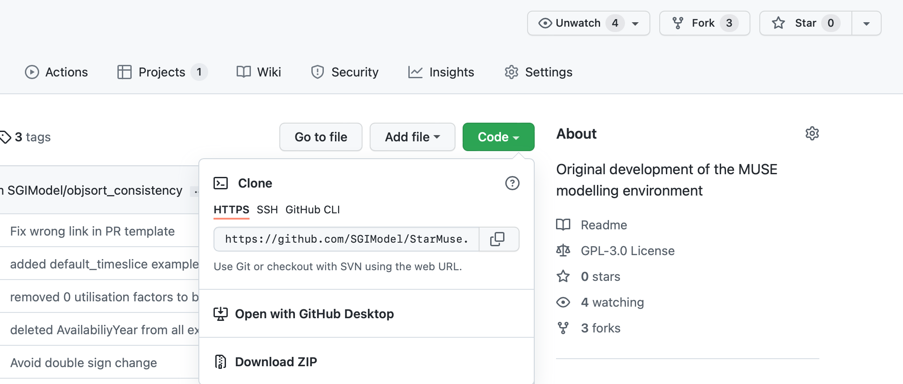
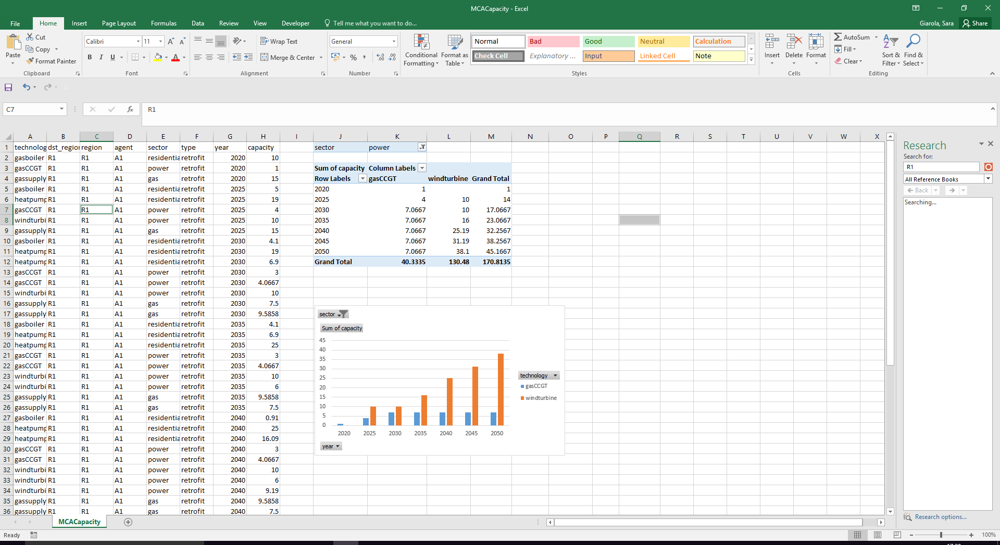

## Short description

This hands-on exercise will allow you to install MUSE on your computer. We will then take you though an example to run and visualise a default MUSE example.

If at any point you get stuck with these hands-on exercises, feel free to post a question in the purpose-made MUSE google, group if your question hasn't already been answered there!:

[https://groups.google.com/g/muse-model](https://groups.google.com/g/muse-model)

For an in-depth look at the MUSE documentation have a look here:
[http://muse-docs.readthedocs.io](http://muse-docs.readthedocs.io)

## Learning objectives

-   Install MUSE
-   Run an example
-   Visualise the results of the example

# Exercise content

In all of the hands-on, there is an accompanying video linked at the start of the lectuer. Here we show you how to do the hands-on. This should make the process simpler to follow.

Hands-on accompanying video:
[https://youtu.be/Gppj1Gl-ajA](https://youtu.be/Gppj1Gl-ajA)

### For Windows users only

Windows users and developers may need to install `Windows Build Tools`. These tools include C/C++ compilers which are needed to build some python dependencies.

MacOS includes compilers by default, hence no action is needed for Mac users.

Linux users may need to install a C compiler, whether GNU gcc or Clang, as well python development packages, depending on their distribution.

If you have MacOS or Linux you can skip this section and head to the next section below here.

1. Install Visual Studio from the following link: [https://visualstudio.microsoft.com/vs/older-downloads/](https://visualstudio.microsoft.com/vs/older-downloads/). Please select the 2019 version. Click on download. 

2. Select the "Visual Studio Community" version. Click on "Download" and save the executable vs_Commmunity.exe.

3. Install Visual Studio by selecting the default options. You may be asked to reboot your computer to complete the installation.

4.   Download the Microsoft Visual C++ Build Tools from the following link: [https://visualstudio.microsoft.com/vs/older-downloads/](https://visualstudio.microsoft.com/vs/older-downloads/). 

5.  Please select the "Build Tools for Visual Studio 2019 (version 16.9)". Click on download. Save the vs_BuildTools.exe.

6.   Run the installer

7. Install options: select only the “Windows 10 SDK” (assuming the computer is Windows 10)]. This will come up on the right-hand side of the screen.

The installation screen should look similar to the following:

{width=100%}

**Figure 1.1:** Visual Studio Installer window


## Installing MUSE

MUSE is developed using python, an open-source programming language, which means that there are two steps to the installation process. First, python should be installed. Then so should MUSE.

The simplest method to install python is by downloading the [Anaconda distribution](https://www.anaconda.com/products/individual). Make sure to choose the appropriate operating system (e.g. windows), python version 3.9, and the 64 bit installer. Once this has been done follow the steps for the anaconda installer, as prompted.

Open the Anaconda prompt for Windows machines or terminal if on MacOS or Linux and create a new environment hosting python 3.8.

Activate the new environment.

```
conda create --name muse python=3.8
activate muse
```

After python is installed we can install MUSE. MUSE can be installed via the Anaconda Prompt or CMD.exe (or any terminal on Mac and Linux). This is a command-line interface to python and the python eco-system. In the anaconda prompt, run:

```
python -m pip install --user git+https://github.com/SGIModel/MUSE_OS
```

If you get an error such as the following:

```
Cannot find command 'git' - do you have 'git' installed and in your PATH
```

Then you have to install git in anaconda. This can be completed by running the following command:

```
conda install git pip
```


It should now be possible to run muse. Again, this can be done in the anaconda prompt as follows:

```
python -m muse --help
```

## Running your first example

In this section we run an example simulation of MUSE, in the next section we will visualise the results.

First we need to download the MUSE source code. To do that navigate to the MUSE GitHub repository:
[https://github.com/SGIModel/MUSE_OS](https://github.com/SGIModel/MUSE_OS)

Click on the green `Code` button in the top right-hand corner and then click on `Download ZIP`. Figure 2.1 shows how to do this, once you are on the relevant page.

{width=100%}

**Figure 2.1:** How to download MUSE

Once you have downloaded the source code, unzip the folder and move it to a location that is convenient for you.

We will place ours on the desktop for simplicity, but feel free to make a folder in your documents or otherwise. 

To run MUSE, we must open the anaconda prompt for Windows machines or terminal if on MacOS or Linux. Then we must navigate to the directory using the prompt or terminal to find the MUSE examples. Ours is in Desktop, so we will run the following command:

```
python -m muse -model --default
```

Alternatively, once we have navigated to the directory containing the example settings (settings.toml) we can run the simulation using the following command in the anaconda prompt or terminal:

```
python -m muse settings.toml
```

If running correctly, your prompt should output text similar to the following:
```
-- 2020-11-03 15:58:29 - muse.sectors.register - INFO
Sector legacy registered.

-- 2020-11-03 15:58:29 - muse.sectors.register - INFO
Sector preset registered, with alias presets.

-- 2020-11-03 15:58:29 - muse.sectors.register - INFO
Sector default registered.

-- 2020-11-03 15:58:29 - muse.readers.toml - INFO
Reading MUSE settings

-- 2020-11-03 15:58:29 - muse.readers.toml - INFO
 Default input values used: carbon_budget_control.commodities, carbon_budget_control.method, carbon_budget_control.debug, carbon_budget_control.control_undershoot, carbon_budget_control.control_overshoot, carbon_budget_control.method_options
```

## Results

If the default MUSE example has run successfully, you should now have a folder called `Results` in the same directory as `settings.toml`.

This directory should contain results for each sector contained within this example (Gas, Power and Residential) as well as results for the entire simulation in the form of the files `MCACapacity.csv` and `MCAPrices.csv`.

`MCACapacity.csv` contains information about the energy capacity each agent has per technology per benchmark year. Each benchmark year is the modelled year in the `settings.toml` file. In our example, this is 2020, 2025, …, 2050.

`MCAPrices.csv` has the converged price of each commodity per benchmark year and timeslice. For example, it has the cost of electricity at night for electricity in 2020, and other similar results.

Within each of the sector result folders, there is an output for capacity for each commodity in each year. Future years, which the simulation has not run to, refers to the technology capacity as it retires. Within the Residential folder there is also a folder for Supply within each year. This refers to how much end-use commodity was output.

Some of these terms will not be familiar to you yet, but do not worry about this for now. This hands-on is just guiding you the basic process from installation to data visualisation and later hands-on material will give more information.

## Visualisation

There are many different ways to visualise the results of MUSE. For example, you could use a programming language such as python or R. In this course, however, we will use Excel for simplicity. 

There are also many different variables and combinations of data that we can plot. In this course we will primarily explore the capacity installed over the time horizon (2020 to 2050). Through this, we can see which of the technologies are invested in and understand the competition between technologies.

To start the visualisation process of the default example, navigate to the folder where you run the `default` example in anaconda prompt or CMD.exe. For instance:

```
cd {MUSE_download_location}/StarMuse/run/example/default/
```

Go into the folder called `/Results/` and right click on the file called `MCACapacity.csv` and open it with Microsoft Excel. Once you've opened the file with Excel, we can begin the data visualisation process.

First, select the PivotChart button under the insert menu. Ensure that the "Select a table or range" highlights all of the data, and the "Choose where you want the PivotChart to be placed" is selected to "Existing worksheet" like in the figure above. Then within the "Table/Range" box, click the cell where you would like the figure to be placed. Click "OK" when finished.

You can choose to filter with "sector", add "technology" to columns, "year" to rows, and display "capacity" as sum.

You can then display a barchart like the one in Figure 1.3, below:

{width=50%}

**Figure 1.3:** Insert -> Create PivotChart


## Summary

In this hands-on we have installed MUSE, learnt how to run a demo example and visualised the results of this demo example. In the next lectures and hands-on we will learn in detail the fundamentals of MUSE and how to edit the demo example for a case study of our choice.

