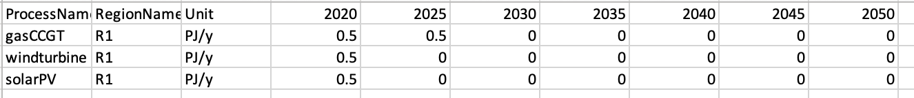
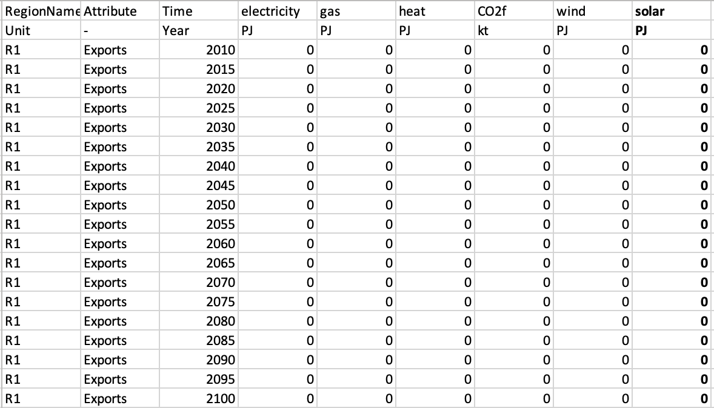
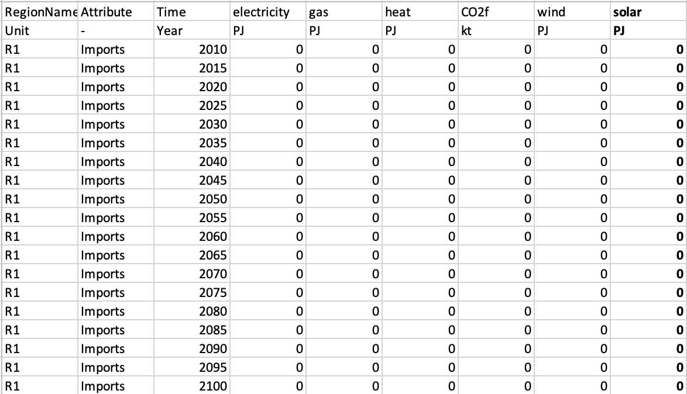
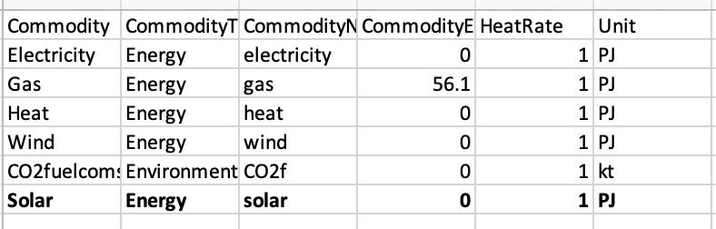

# Learning objectives

-   Learn how to add a new technology in MUSE

## Addition of solar PV

In this section, we will add solar photovoltaics to the default model. We will be starting from scratch and not continuing with the examples from hands-on 2 and 3. Therefore, to achieve this, we must modify the input files in the default example (default.zip) which can be found in the zenodo link provided below.

[https://zenodo.org/record/6092287#.YgvOEy-l1pQ](https://zenodo.org/record/6092287#.YgvOEy-l1pQ)

## Technodata Input

We must note, before starting, that we require consistency in input and output units. For example, if capacity is in PJ, the same basis would be needed for the output files `CommIn.csv` and `CommOut.csv`. In addition, across sectors a commodity needs to maintain the same unit. In these examples, we use the unit petajoule (PJ).

Next, we will edit the `CommIn.csv` file in the power sector, which specifies the commodities consumed by solar photovoltaics.

The table below shows the original `CommIn.csv` version in normal text, and the added column and row in bold.

{width=100%}

**Figure 4.1:** Modified CommIn.csv file for the power sector

We must first add a new row at the bottom of the file, to indicate the new solar photovoltaic technology:

- we call this technology `solarPV`
- place it in region `R1`
- the data in this row is associated to the year 2020
- the input type is fixed
- `solarPV` consumes solar

As the solar commodity has not been previously defined, we must define it by adding a column, which we will call `solar`. We fill out the entries in the solar column, ie. that neither `gasCCGT` nor `windturbine` consume solar.

We repeat this process for the file: `CommOut.csv`. This file specifies the output of the technology. In our case, solar photovoltaics only output electricity. This is unlike `gasCCGT` which also outputs `CO2f`, or carbon dioxide.

{width=100%}

**Figure 4.2:** Modified CommOut.csv file for the power sector

Similar to the the `CommIn.csv`, we create a new row, and add in the solar commodity. We must ensure that we call our new commodity and technologies the same as the previous file for MUSE to successfully run, i.e. `solar` and `solarPV`. Please note that the commodity names are case-sensitive.

Please note that we use flat forward extension of the values when only one value is defined. For example, in the `CommOut.csv` we only provide data for the year 2020. Therefore for the benchmark years, 2025, 2030, 2035… we assume the data remains unchanged from 2020.

The next file to modify is the `ExistingCapacity.csv` file. This file details the existing capacity of each technology, per benchmark year. For this example, we will set the existing capacity to be 0.5 for all technologies in the base year and 0 for the remaining years. Please note, that the model interpolates between benchmark years linearly.

{width=100%}

**Figure 4.3:** Modified ExistingCapacity.csv file for the power sector

Finally, the technodata.csv contains parametrisation data for the technology, such as the cost, growth constraints, lifetime of the power plant and fuel used. The technodata file is too long for it all to be displayed here, so we will truncate the full version.

Here, we will only define the parameters: `processName`, `RegionName`, `Time`, `Level`,`cap_par`, `Fuel`, `EndUse`, `Agent2` and `Agent1`

We shall copy the existing parameters from the windturbine technology for the remaining parameters that can be seen in the `technodata.csv` file for brevity. You can see the full file at the zenodo link, below:

[https://zenodo.org/record/6092287#.YgvOEy-l1pQ](https://zenodo.org/record/6092287#.YgvOEy-l1pQ)

Again, flat forward extension is used here. Therefore, as in this example we only provide data for the benchmark year 2020, 2025 and the following benchmark years will keep the same characteristics, e.g. costs, for each benchmark year of the simulation.


{width=100%}

**Figure 4.4:** Modified Technodata.csv file for the power sector

Notice that we have hidden the cells between F and T. These are the same as the `windturbine` technology, but we've changed the `cap_par` input to 30 and the `Fuel` technology to `solar`.

## Global inputs

Next, navigate to the input folder, found at:

```
{muse_installation_location}/src/muse/data/example/default/input
```

We must now edit each of the files found here to add the new solar commodity. The edited files can be viewed in the zenodo link below:

[https://zenodo.org/record/6092287#.YgvOEy-l1pQ](https://zenodo.org/record/6092287#.YgvOEy-l1pQ)

The `BaseYearExport.csv` file defines the exogenous exports for commodities. For our example we add a column to indicate that there is no export for solar. However, it is important that a column exists for our new commodity.

It is noted, however, that the `BaseYearImport.csv` as well as the `BaseYearExport.csv` files are optional files to define exogenous imports and exports; all values are set to zero if they are not used.

{width=100%}

**Figure 4.5:** Modified BaseYearExport.csv file for the power sector

The `BaseYearImport.csv` file defines the imports in the base year. Similarly to `BaseYearExport.csv`, we add a column for solar in the `BaseYearImport.csv` file. Again, we indicate that solar has no imports.

{width=100%}

**Figure 4.6:** Modified BaseYearImport.csv file for the power sector

The `GlobalCommodities.csv` file is the file which defines the commodities. Here we give the commodities a commodity type, CO2 emissions factor and heat rate. For this file, we will add the `solar` commodity, with zero CO2 emissions factor and a heat rate of 1.


{width=100%}

**Figure 4.7:** Modified GlobalCommodities.csv file for the power sector

The `projections.csv` file details the initial market prices for the commodities. The market clearing algorithm will update these throughout the simulation; however, an initial estimate is required to start the simulation. As solar irradiance as a fuel is free, we will indicate this by adding a final column.

Please note that the unit row is not read by MUSE, but used as a reference for the user. The units should be consistent across all input files for MUSE; MUSE does not carry out any unit conversion.


{width=100%}

**Figure 4.8:** Modified projections.csv file for the power sector

## Running our customised simulation

Now we are able to run our simulation with the new solar power technology.

To do this we run the same run command as previously in the anaconda command prompt:

```
python -m muse settings.toml
```

If the simulation has run successfully, you should now have a folder in the same location as your `settings.toml` file called `Results`. It must be noted, however, that if you update a value and re-run the model, the results folder will be overwritten.

The next step is to visualise the results using Excel.

We will use the PivotChart, similar to that shown in hands-on 1. The file to be used is the MCACapacity.csv file. For our visualisation we have selected a stacked area chart, but you are free to choose the type you like.

{width=100%}

**Figure 4.9:** Visualisation with new technology.

The power sector now shows us the new `solarPV` technology. 


