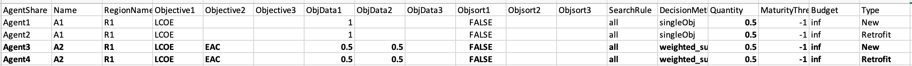
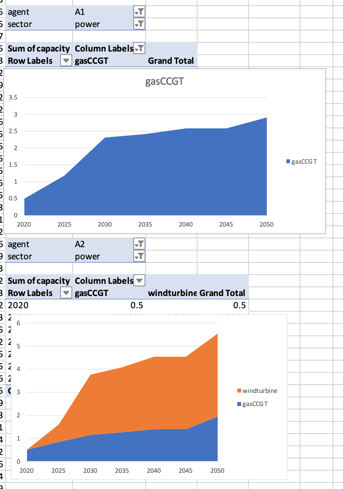

Now we will learn how to add a new agent to our example.

# Learning objectives

- How to add a new agent

# Introduction

In this hands-on, we will add a new agent called `A2`. This agent will be slightly different to the other agents in the `default` example, in that it will make investments based upon a mixture of levelised cost of electricity (LCOE) and equivalent annual cost (EAC). These two objectives will be combined by calculating a weighted sum of the two when comparing potential investment options. We will give the LCOE a relative weight value of 1 and the EAC a relative weight value of 0.25.

We will edit the default example to add a new agent, which can be found from the following zenodo link:


To achieve this, first, we must modify the Agents.csv file in the directory:
```
{muse_install_location}/src/muse/data/example/default/technodata/Agents.csv
```

To do this, we will add two new rows to the file. To simplify the process, we copy the data from the first two rows of agent A1, changing only the rows: `AgentShare`, `Name`, `Objective1`, `Objective2`, `ObjData1`, `ObjData2`, `DecisionMethod` and `Quantity`. The values we changed can be seen below. Notice how we edit the `AgentShare` column. This variable allows us to split the existing capacity between the two different agents. We will also need to edit the technodata file to define these new AgentShares.

{width=100%}

**Figure 6.1:** Updated technodata.

Also notice that we amend the Quantity column. The reason for this is that we want to specify that Agent `A1` makes up 50% of the population, and `A2` makes up the remaining 50% of the population.

We then edit all of the technodata files to split the existing capacity between the two agents by the proportions we like. As we now have two agents which take up 50% of the population each, we will split the existing capacity by 50% for each of the agents. Notice that we only require the columns `Agent2` and `Agent4` to define the retrofit agents.

The new technodata file for the power sector will look like the following (we have hidden the middle columns as they remain the same):

{width=100%}

**Figure 6.2:** Edited power technodata file.

However, remember you will have to make the same changes for the residential and gas sectors!

We will now save this file and run the new simulation model using the following command in Anaconda prompt:

```
python -m muse settings.toml
```

Figure 6.3 shows us the results of these two agents. We can see a divergence between technologies invested in by the agents dependent on their objectives

{width=100%}

**Figure 6.3:** Visualisation of the two different agents - a) agent = A1, b) agent = A2.


# Summary

In this hands-on we added a new agent which had different characteristics to the original agent and saw that this lead to a dramatic change in technologies invested in.