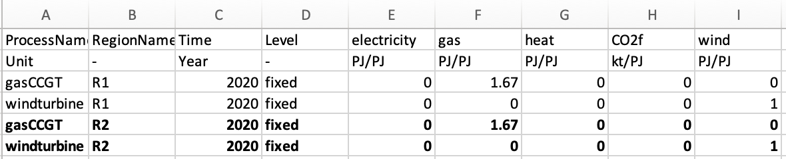
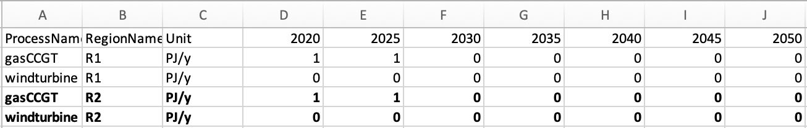
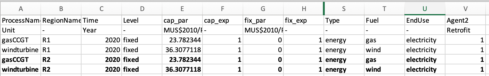

Now we will learn how to add a new region to our example.

# Learning objectives

- Learn how to add a new region

# Introduction

The next step is to add a region which we will call `R2`, however, this could equally be called `USA` or `India`. These regions do not have any energy trade. This requires us to undertake a similar process as before of modifying the input simulation data. However, this time we will also have to change the `settings.toml` file to achieve this.

The process to change the `settings.toml` file is relatively simple. We just have to add our new region to the regions variable, in the 4th line of the `settings.toml` file, like so:

```
regions = ["R1", "R2"]
```

The process to change the input files, however, takes a bit more time. To achieve this, there must be data for each of the sectors for the new region. This, therefore, requires the modification of every input file.

Due to space constraints, we will not show you how to edit all of the files. However, you can access the modified files at the zenodo link below:
https://zenodo.org/record/6327789#.YiI1ri-l1pQ

Effectively, for this example, we will copy and paste the results for each of the input files from region `R1`, and change the name of the region for the new rows to `R2`.

However, as we are increasing the demand by adding a region, as well as modifying the costs of technologies, it may be the case that a higher growth in technology is required. For example, there may be no possible solution to meet demand without increasing the `windturbine` maximum allowed limit. We will therefore increase the allowed limits for `windturbine` in region `R2`.

We have placed two examples as to how to edit the power sector below. Again, the edited data are highlighted in **bold**, with the original data in normal text.

The following file is the modified `/technodata/power/CommIn.csv` file:

{width=100%}

**Figure 7.1:** Updated CommIn.csv.

Whereas the following file is the modified `/technodata/power/ExistingCapacity.csv` file:

{width=100%}

**Figure 7.2:** Updated ExistingCapacity.csv.

Below is the reduced `/technodata/power/technodata.csv` file, showing the increased capacity for `windturbine` in `R2`. For this, we highlight only the elements we changed from the rows in `R1`. The rest of the elements are the same for `R1` as they are for `R2`.

Again, we don’t show the entries for 2040, apart from the edited `windturbine` row, for the sake of brevity.

{width=100%}

**Figure 7.3:** Updated Technodata.csv.

Now, go ahead and amend all of the other input files for each of the sectors, the Agents file and the input files `BaseYearExport`, `BaseYearImport` and `Projections.csv` by copying and pasting the rows from `R1` and replacing the `RegionName` to `R2` for the new rows. All of the edited input files can be seen at the zenodo link:
https://zenodo.org/record/6327789#.YiI1ri-l1pQ

Again, we will run the results using the `python -m pip muse settings.toml` in anaconda prompt, and analyse the data using excel as follows:

{width=100%}

**Figure 7.3:** Capacity visualisation for both regions in the power sector - a) Region = R1, b) Region = R2.


# Summary

In this hands-on we added a new fictional region with the same characteristics for both of these regions. We see that the output of the two regions in the power sector are the same. This is because the characteristics in both regions are identical.