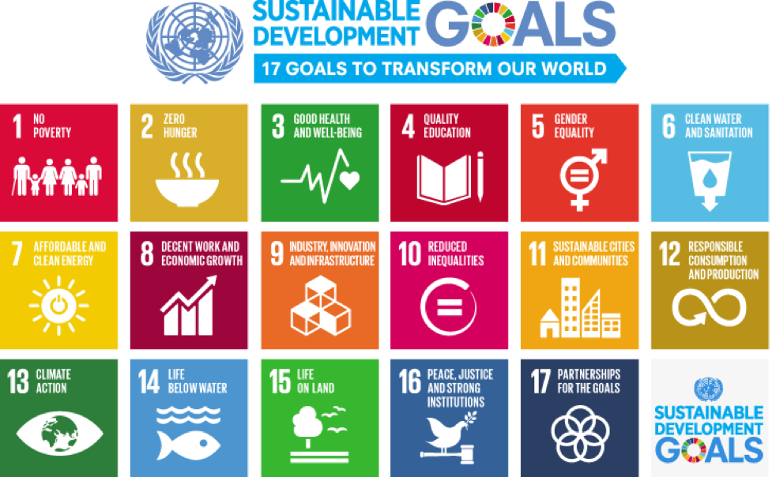

## Short description

This mini-lecture will provide a background to sustainable development,
the global agendas of the Sustainable Development Goals (SDGs), and the
Paris Agreement, and will introduce the role energy systems can play in
achieving a range of sustainable development outcomes.

## Learning objectives

-   Learn the importance of sustainable development and how it frames
    the major global development agendas
-   Identify the general principles of the Sustainable Development Goals
    and the Paris Agreement.

# Lecture content

## Introduction

The sustainable development goals (SDGs) are a set of universal goals for every country. The SDGs are focused on ending poverty, improving quality of life and protecting the environment. These goals were agreed on in 2015, with 2030 set as a target year for achieving them. The sustainable development goals aim to tackle multiple issues. Some of the goals are based around poverty, environmental protection, climate action, justice and more. The SDGs can be seen in Figure 1.2.1. These goals are designed to be thought of together, rather than in isolation. There are, therefore, many links between different goals. 

{width=100%}

**Figure 1.2.1:** The 17 Sustainable Development Goals
[@UnitedNations2015]

In this lecture we will explore these links, global progress on the SDGs and how to factor these goals into national planning and modelling efforts.

## Sustainable Development Goal 7

The Sustainable Development Goal 7 (SDG7) specifically focuses on the energy sector. The first ta

{width=100%}

**Figure 1.2.1:** Sustainable Development Goal 7
[@UnitedNations2015]

## Summary

Sustainable development -- meeting the needs of current and future
generations across social, economic and environmental dimensions --
frames much of the global policy discourse incorporated in the global
development agendas, including the Sustainable Development Goals and the
Paris Agreement. These agendas provide frameworks for achieving the
climate and development outcomes needed to achieve a sustainable future.
Infrastructure plays a very large role by providing a multitude of
services to users and supporting most sectors and domains of our
society. Investment in sustainable infrastructure will thus need to be
ambitious in targeting these sustainable outcomes, above and beyond
providing for basic needs.
