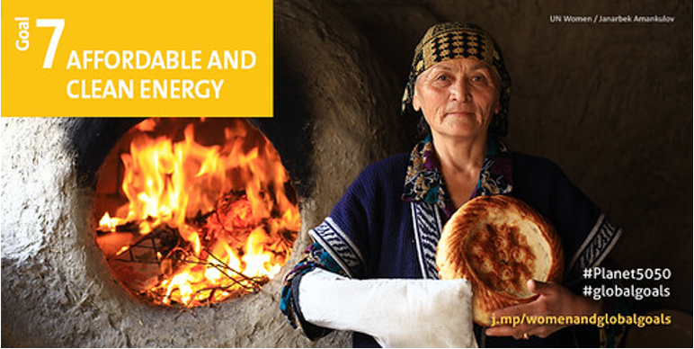

## Short description

This mini-lecture will provide a background to sustainable development, the global agendas of the Sustainable Development Goals (SDGs) and an introduction to the role energy systems can play in achieving a range of sustainable development outcomes.

## Learning objectives

- Learn the importance of sustainable development and how it frames
    the major global development agendas
- Identify the general principles of the Sustainable Development Goals

# Lecture content

## Introduction

The Sustainable Development Goals (SDGs) are a set of universal goals for every country. The SDGs are focused on ending poverty, improving quality of life and protecting the environment. These goals were agreed on in 2015, with 2030 set as the target year for their achievement. The Sustainable Development Goals aim to tackle multiple issues. Some of the goals are based around poverty, environmental protection, climate action, justice and more. The SDGs can be seen in Figure 1.2.1. These goals are designed to be thought of together, rather than in isolation. There are, therefore, many links between different goals.

{width=100%}

**Figure 1.2.1:** The 17 Sustainable Development Goals
[@UnitedNations2015]

In this mini-lecture we will explore these links, global progress on the SDGs and how to factor these goals into national planning and modelling efforts.

## Sustainable Development Goal 7

Sustainable Development Goal 7 (SDG7) specifically focuses on the energy sector. Each SDG has more specific targets. The first target set in SDG7 is universal access to affordable, reliable and modern energy services. This includes electricity and access to clean cooking. Next, SDG7 calls for a substantial increase in the share of renewables in the global energy mix. This is to reduce greenhouse gas emissions and increase the sustainability of energy supplies. Another important element of improving the sustainability of the energy sector is energy efficiency. Therefore, the next SDG7 target requires a doubling of the rate of global improvement in energy efficiency. Finally, SDG7 targets improved cooperation to increase access to clean energy research and technology to promote investment, as well as expanded and improved modern energy infrastructure in developing countries. All of these targets are set in pursuit of reduced poverty and greater sustainability. Whilst SDG7 focuses explicitly on the energy sector, we will see later that all of the goals are strongly interlinked as energy is important for multiple other goals.

{width=100%}

**Figure 1.2.2:** Sustainable Development Goal 7
[@UnitedNations2015]

## Progress on SDG7: Access to Electricity and Clean Cooking

According to the tracking SDG7 report, there has been progress in improving access to both electricity and clean cooking in recent years. This report states that electricity access increased from 83% in 2010 to 90% in 2018, whilst clean cooking increased from 56% to 63%. The report finds, however, that the current rates of progress are insufficient to meet the targets set by SDG7 by 2030. There are also key regions where progress has been substantially slower. For example, the population without access to electricity is concentrated in Sub-Saharan Africa -- with an overall access rate of 47%.

There are several ways in which energy modelling can be used to aid with these goals. For instance, geospatial electrification modelling can be used to assess which access solutions are the most economical for different regions or sub-regions. This also includes capacity expansion planning to assess how supply can be increased whilst minimising economic and environmental impacts.

## Progress on SDG7: Renewable Energy and Energy Efficiency

The graph below shows the share of electricity, heat and transport demands met by renewables (such as solar, wind, hydro and geothermal energy) globally. We can see that there has been some progress in increasing the share of renewables in the electricity and transport sectors as well as in the heat sector when traditional biomass use is excluded. According to the SDG7 Tracking Report, the share of renewable energy in Total Final Energy Consumption reached 17.3% in 2017, up from 16.3% in 2010.

The electricity sector has observed the most progress. This is largely due to the growth in solar photovoltaic (PV) and wind energy. However, more progress is required to achieve SDG7, with most scenarios requiring the decarbonisation of end-use sectors: for example, the electrification of transport and heat, sectors which have observed relatively slow progress.

{width=100%}

**Figure 1.2.4:** Renewable energy and energy efficiency progress
[@UnitedNations2015]

For energy efficiency, global reductions in primary energy intensity have slowed in recent years. Where energy intensity is the quantity of energy required per unit output or activity, so that using less energy to produce a product reduces the intensity. This is despite progress still being greater than in the period before 2010. The SDG7 Tracking Report analysis shows that the transport sector has seen an increase in energy intensity improvement since 2010, while other sectors have seen a decrease. Differences between regions are observed, with Sub-Saharan Africa having the highest energy intensity and Latin America and the Caribbean having the lowest.

If the SDG7 target of doubling the rate of global improvement in energy efficiency by 2030 is to be met, energy efficiency measures must be prioritised in policy making and investment planning.

## Links between SDGs

The SDGs are highly interlinked, with synergies and trade-offs between these targets. It is important that these interactions are understood so that policymakers can make plans to maximise synergies and minimise trade-offs. Modelling can help in the making of informed decisions by providing a better understanding of these interactions. This is because models can be used to develop cross-sectoral scenarios and can help project the impacts of decisions.

As an example, let us explore the links between the energy system and the SDG targets. One study [@nerini2018mapping] found that at least 113 of the 169 SDG targets require changes in energy systems. Examples of this include targets in SDG13, which focus on climate change action. This requires decarbonisation of the energy system. In addition SDG1, which focuses on ending poverty, requires improved energy infrastructure to increase modern energy access. Nerini et al. (2018) highlight that we cannot think in silos and must use integrated planning approaches with a long-term perspective. Energy modelling tools are a key enabler of such approaches.

## Summary

In this mini-lecture we have explored the Sustainable Development Goals and how these apply to the energy systems and energy modelling domain. We discovered that the Sustainable Development Goals are highly interlinked, with the existence of different synergies and trade-offs between these different goals.

While much progress has been made, significant further progress is required to meet many of these goals. Modelling approaches can be utilised to aid this aim by exploring integrated planning approaches with a long-term perspective.
