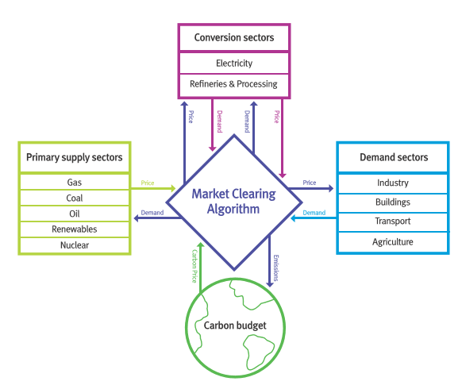

# Short description

In this mini-lecture we will give you an overview of how MUSE works. This will include the different sectors that make up MUSE, including primary supply sectors, conversion sectors and demand sectors. We will discover how these sectors are interlinked through a market clearing algorithm, which ultimately decides the prices of energy commodities and the final energy system, according to MUSE. 

# Learning objectives

- Identify the key components which make up MUSE
- Understand the fundamental underpinning of how MUSE works

# MUSE Visualisation

MUSE is made up of various components which interact to give a projected energy system as an output. Figure 2.2.1 displays these major components. The key sections of MUSE include:

- Primary supply sectors
- Conversion sectors
- Demand sectors
- Climate model (in the current model this is simplified by the use of a carbon budget.)
- Market clearing algorithm (MCA)

{width=100%}

**Figure 2.2.1:** Different components which make up MUSE.

MUSE works by iterating between the sectors shown in Figure 2.2.1 to ensure that energy demands are met by the technologies chosen by the agents. Next, we will detail the calculations made by MUSE throughout the simulation.

- The service demand is calculated. For example, how much electricity, gas and oil demand is there for the energy services of cooking, building space heating and lighting in the residential sector? It must be noted, that this is only known after the energy service demand sector is solved and the technologies invested in are decided.

- A demand sector is solved. That is, agents choose end-use technologies to serve the demands in the sector. For example, they compare electric stoves to gas stoves to meet the energy service demand of cooking. They then choose between these technologies based upon their:

  - Search space (which technologies are they willing to consider?)
  - Their objectives (which metrics do they consider important?)
  - Their decision rules (how do they choose to combine their metrics if they have multiple?)

- The decisions made by the agents in the demand sectors then leads to a certain level of demand for energy commodities, such as electricity, gas and oil, as a whole. This demand is then passed to the MCA.
The MCA then sends these demands to the sectors that supply these energy commodities (supply or conversion sectors).

- The supply and conversion sectors are solved: agents in these sectors use the same approach (i.e. search space, objectives, decision rules) to decide which technologies to investment in to serve the energy commodity demand. For example, agents in the power sector may decide to invest in solar photovoltaics, wind turbines and gas power plants to service the electricity demand.

- As a result of these decisions in supply and conversion sectors, a price for each energy commodity is formed. This price is formed based on the levelized cost of energy of the marginal technology. That is the technology which produces the marginal quantity. This price is then passed to the MCA.

- The MCA then sends these prices back to the demand sectors, which are solved again as above.

- This process repeats itself until commodity supply and demand converges for each energy commodity for each region. Once these converge, the model has found a “partial equilibrium” on the energy system and it moves forward to the next time period.

# Summary

This mini-lecture provided key information to understand the underlying mechanics of MUSE. We learnt how MUSE is made up of different sectors, which are linked by a market clearing algorithm to simulate how prices are calculated. This mechanism closely models the real-life global electricity market through a partial equilibrium mechanism. 
