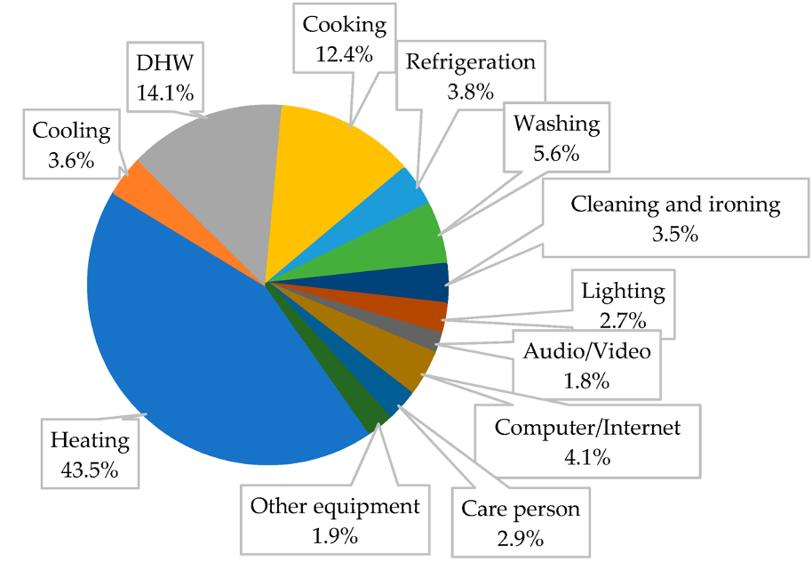
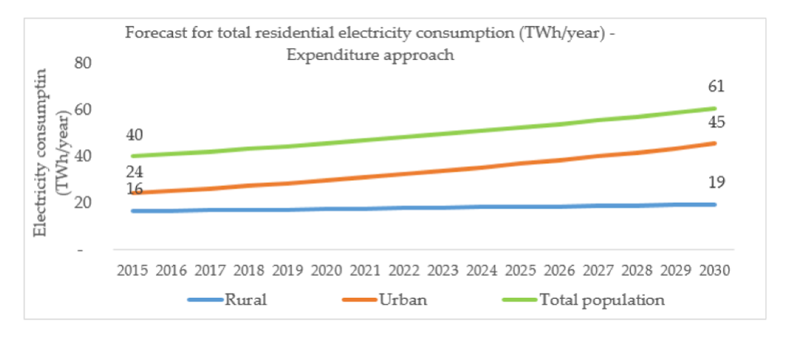
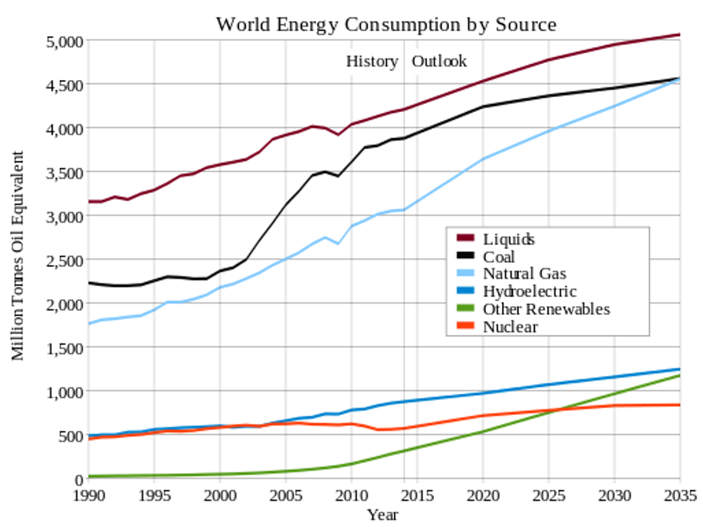
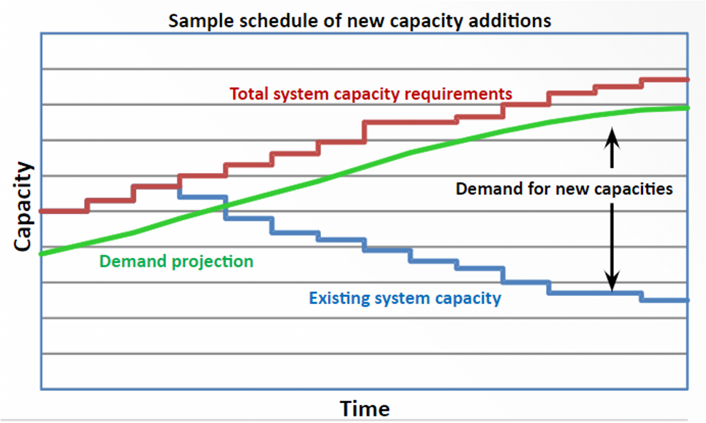

To begin Lecture Block 3, this mini-lecture provides an overview of  

# Learning objectives

-   Fill here

# Introduction

Everyone needs energy for many different purposes. The form that this energy should be delivered is dependent on the specific applicatoin. These demands for energy come from all sectors of society such as:

- The residential sector (rural and urban) 
    - Cooking
    - Heating
    - Cooling
    - Lighting
    - Appliances
- Industry
    - Chemical processes
    - Steam production
    - Heating
- Commerce
    - Lighting
    - Heating
    - Cooling buildings
    - Keeping products at low temperatures
- Transport
    - Cars
    - Trucks
    - Buses
    - Aviation
    - Shipping
    - Trains
- Agriculture
    - Tractors
    - Machinery
    - Pumping water

## Variations in daily energy demand

These energy demands can vary on an hourly, daily, weekly and monthly timescales. This mainly reflects the schedule of consumers' activities. For example, on a monthly timescale more cooling will be used in summer and more heating in winter. However, these energy demands can also vary by sector, as shown by Figure 3.1.1.

{width=100%}

**Figure 3.1.1:** Variations of energy demand by sector [@Taliotis2018] 

Figure 3.1.1 shows us that the magnitude of demand varies by sector, with agricultural demand significantly lower than residential and commercial demand, in this example. The reason that the commercial and residential consume more is because their activities are more energy intensive or are simply larger.

We can also see that the daily profile of demand varies by sector. For example in Figure 3.1.1 we can see that there is a clear evening peak in residential demand, whereas agricultural and industrial remain flat throughout the day. This is because agricultural and industrial demands are consistent throughout the day. This is likely because the industrial and agricultural sector operate constantly, whereas energy use in homes peaks in the evening when consumers use more electricity for cooking, lighting and appliances when they return from work or other business.

## Sector specific demands

The differences between sectors means that it can sometimes be important to model demands separately by each sector. This allows our models to consider the specific characterstics of each demand. 

Within each of these sectors, the energy demand varies over time and across different types of consumers. For example, within the residential sector, demands can differ between rural and urban households, as shown in Figure 3.1.2. This can also be true between grid-connected and off-grid areas. Energy planners must ensure that energy demand is always met for all types of consumers. Therefore, it is important that the key characteristics of demands are represented in energy models.

{width=100%}

**Figure 3.1.2:** Variations of energy demand for the residential sector by population classes [@Olaniyan2018]

## Long-term variations in energy demands

A major challenge in energy planning is that energy demands can change over time. This could be due to population growth or the creation of new indusrtries. Figure 3.1.1 displays historical variations in energy demands. It is likely that these demands are correlated to changes in society. For example, increases in energy demand likely refelct increased industrial activity. For energy planning, we must also think about how energy demands are likely to change in the future. 

We can often forecast energy demand, such as with future projections as shown in Figure 3.1.3. These forecasts can be created using estimates of the key influencers of energy demand, such as population growth and economic activity. Future projections are often based on how energy demands have changed historically. 

{width=100%}

**Figure 3.1.3:** Long-term energy consumption by source

## Capacity expansion planning

One of the key purposes of MUSE is for capacity expansion. Figure 3.1.4 displays this key issue which MUSE can address. Effectively, if total demand increases (green line) and existing system capacities are retired (blue line), how can we invest to meet demand (red line)? 

{width=100%}

**Figure 3.1.4:** Capacity expansion [@Taliotis2018]

You may notice that the red line is higher than the green line at all points. This is due to losses due to lower generating efficiencies. The gap between the red and blue lines demonstrates the required capacity expansion over time. MUSE enables us to plan such a capacity expansion whilst considering technical, economic and envionmental constraints.

# Summary

