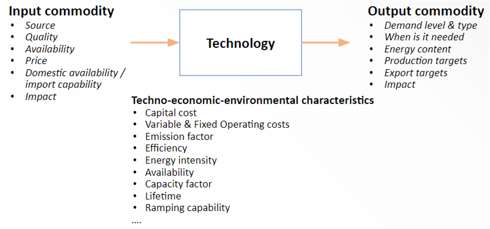

This lecture will introduce the various technologies and how we can represent them within MUSE. We will also learn about the supply chains in which these technologies exist. Finally, we will learn about the key characteristics of the different technologies in the context of MUSE.

# Learning objectives

- Understand the concepts of technologies and supply chains

- Learn how to represent technologies in MUSE

- Understand the key characteristics of technologies

# Introduction

A technology in MUSE represents a process, or a group of processes, that:

- Converts energy from one form into another. For example, the conversion of crude oil to oil products, oil products to electricity or electricity to heat.
- Transfers, transmits or distributes a form of energy, for example electricity transmission technologies.
- Supplies or produces a form of energy, for example oil imports or extraction, or a hydropower plant generating electricity.

## Technology examples

Now we will discuss specific technologies and their role in the energy system.

Within the energy system there exists natural gas for the generation of electricity. However, we have to represent a technology which extracts natural gas in the system. We can call this technology "gas extraction", which outputs natural gas. This technology does not have any input fuel as it is a primary energy supply technology.

A coal power plant, on the other hand, has an input of coal and an output commodity of electricity. This technology is an energy conversion technology and converts the energy in coal to electricity.

Similarly, an oil power plant converts the energy in oil to electricity. It therefore has an input fuel of oil and an output commodity of electricity.

It must be noted that some technologies can have more than one input or output fuel, such as a refinery with oil as the input fuel, producing both gasoline and heavy fuel oil as output fuels.

## Parameters that define technologies

There are three main groups of parameters that are used to define technologies. These can be seen in Figure 4.1.1 below. These include input commodities, which refer to the fuel supply to the technology. For instance, what is the input fuel, what is the price of this, and what is the availability? Crucially, it can also contain the greenhouse gas emissions associated with the fuel.

Secondly, there is techno-economic and environmental characteristics of technologies. These include technology costs, efficiency, lifetime and availability.

Finally, we need to define each technology's output commodity. This is the commodity which it produces, such as electricity from solar PV. Important data on output commodities includes their demand, impacts and when it is needed.

{width=100%}

**Figure 4.1.1:** Technology definitions by example parameters [@Taliotis2018]

## Representing technologies in MUSE

Since models are abstractions of reality, we can define technologies at different levels of abstraction depending on the nature of our energy model. Within MUSE, for instance, a single technology can represent a single power plant, or a group of similar power plants (for example, a technology could represent all coal power plants in a region if they had similar characteristics). The information provided can create a model with more or less granular data based upon the requirements of the user. It must be noted, that with increased granularity, an increase in computation time will be observed.

It is possible within MUSE to represent all power plants as a single technology. This is appropriate when technologies do not change significantly between power plants or extraction plants.

## Key characteristics of technologies

There are a number of different important technology characteristics that should be considered in capacity expansion planning. MUSE allows for several of these characteristics to be included. Such as:

- Variation in the availability, efficiency and costs of a technology over short and long timescales. For example, it may be the case that solar power reduces in costs over the next 30 years. If this happens, we would like to model this process and see the long-term effect on the market.
- MUSE can consider the limits on production by technology and capacity constraints. For example, there may only be a certain amount of hydro resources in a particular country, based on the number of rivers etc. It is important that MUSE takes this into account to ensure that the results are aligned to the reality in a region or country.
- Finally, the emissions associated with technologies can be captured. For example, we may want to reduce the carbon dioxide emissions of an entire system. This would allow us to compare scenarios and enable us to understand how we can reduce these emissions to reduce the impact of climate change. MUSE is also able to impose a limit on emissions through a constraint.

# Summary

In this mini-lecture we have learned the importance of technologies within MUSE. We learnt that a technology can refer to a single power plant, to all coal power plants, for example. This is largely based on the requirements of individual case studies. We also learnt that technologies can also be processes, such as the extraction of natural gas. All of these different technologies come together to build an entire energy system, which MUSE is able to model.
