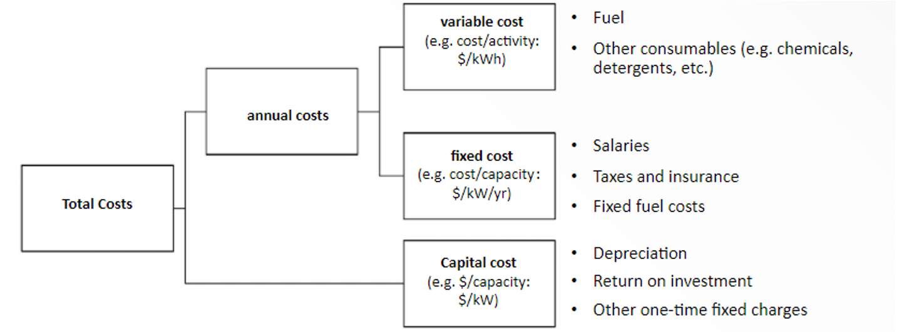

This mini-lecture will describe the techno-economic data that defines technologies in MUSE. These technoeconomics are fundamental to the functioning of a good MUSE model. Most technologies can be characterised by their efficiencies,  technoeconomics and inputs and outputs. This is because the technologies must be competitive against each other in an economic sense.

# Learning objectives

- Understand the main technoeconomic parameters
- Understand how these parameters can impact investment decisions

# Technology costs

In this mini-lecture we will describe the different techno-economic parameters that MUSE defines, primarily in the `Technoeconomic.csv` file found in the different sector folders.

Figure 4.2.1 displays the different cost types as defined in MUSE. The total costs are largely split into capital costs and annual costs. Capital costs, as shown by the figure, are the costs of depreciation, return on investment and other one-time fixed charges. This can include the initial costs of the technology such as construction.

Then there are annual costs, which are split into variable and fixed costs. There is a distinction between these two types of costs, where fixed costs depend on the capacity of the power plant, whereas variable costs depend on the amount of energy output in a year. For instance, if a power plant does not output any electricity, it will not have to pay for fuel. However, it will still have to pay for salaries to look after the plant.

{width=100%}

**Figure 4.2.1:** Cost types [@Taliotis2018]

In MUSE, these are defined in the `cap_par`, `cap_exp`, `fix_par`, `fix_exp`, `var_par`, and `var_exp` variables where:

-- `cap_par` is the capital costs, and `cap_exp` is the exponential component of this. Effectively, the `cap_exp` defines the reduction in cost due to economies of scale as the investment into this technology and its capacity increases. This should be a number between 0 and 1.
-- `fix_par` is the fixed costs, and `fix_exp` is the exponential component similar to the exponential component in `cap_exp`.
-- `var_par` is the fixed costs, and `var_exp` is the exponential component.

The exponential component can be chosen from relevant data, but can often by difficult to find. In that case it is okay to use a number such as 1 or 0.95 as a rough indication.

## Growth constraints

As previously mentioned, it is important to place realistic constraints on the growth of technologies. For instance, there is only so much resource or land potential for renewable energy resources, such as offshore wind. If a country or region does not have any access to land offshore, the limit for offshore wind should be zero. On top of this, it may not be possible to grow and install technologies faster than a certain rate. For instance, there may not be enough resources, such as steel and labour, to double the capacity of wind in a certain country.

The parameters which set these can be found in the `Technodata.csv` file and are called:

- `MaxCapacityGrowth`
- `MaxCapacityAddition`
- `TotalCapacityLimit`

## Other technoeconomic parameters

Other technoeconomic parameters include the lifetime of a technology, scaling size and interest rate. A technology may become much more attractive if we are able to use it for a longer amount of time. For instance, the economics of nuclear power plants can be very sensitive to the length of time they can be used for due to their high capital costs. It is therefore important that we have good data on the lifetime of the plant. This is set by the `TechnicalLife` parameter.

The scaling size defines how small a single unit can be. For instance, a single nuclear power plant outputs a lot more energy than a single solar photovoltaic panel. This detail can be set by the `ScalingSize` parameter.

The interest rate is the parameter which defines the discount rate. For instance, a technology may have a 2% return on investment, which may seem good. But it could also be possible to put the money required to build a technology into a high interest savings account and have a 4% investment. Thus the 2% return would actually reflect a loss relative to the rate of interest. This opportunity cost is the interest rate defined in the `InterestRate` parameter.

## Inputs and outputs

Finally, there are the input and output parameters. For a gas power plant, the input is gas and the end use is electricity. This can be set in the `Fuel` and `EndUse` parameters respectively.

# Summary

 In this mini-lecture we have discovered the main components which make up the Technodata sheet. We discovered the importance of properly defining the costs, lifetime and other characteristics which have a large impact on the final investment decisions.
