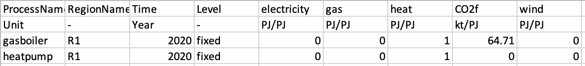

In this mini-lecture we will learn about the input and output commodities within MUSE. Specifically we will learn what the `CommIn.csv` and `CommOut.csv` files do and how these relate to the energy system.

# Learning objectives

- To learn the importance of input and output commodities
- To learn how we can modify these commodities in MUSE

# Introducing commodities

Input commodities are the commodities consumed by each technology. This could be coal for a coal power plant, uranium for a nuclear power plant or electricity for an electric heater. This is dependent on the technology, and some technologies can have multiple inputs.

Output commodities are similar, but are the outputs of technologies. For example the output of any power plant will be electricity, and for heaters the output will be heat. Again, this is dependent on the technology, and some technologies can have multiple outputs such as combined heat and power plants.

The ratio between these two parameters is very important in MUSE and in energy modelling in general. This is because it defines the efficiency of the technology. For instance, if a coal power plant requires 1 PJ of energy stored in coal to output 0.8 PJ of electricity, the coal power plant has an efficiency of 0.8. The higher the efficiency the more economical the power plant is and the more competitive it will be when compared to different technologies.

## Editing the CommIn and CommOut files

Within MUSE there are two files which one should change to edit these parameters: the `CommIn.csv` and `CommOut.csv` files. These files are found within the sector folders of the case study. For instance, in the `power/CommIn.csv` or `gas/CommOut.csv` directories.

In this example we will look at the residential sectors `CommIn.csv` and `CommOut.csv` files. An example `CommIn.csv` file can be seen in the figure below:

{width=100%}

**Figure 4.3.1:** CommIn file for the residential sector

Here we see two technologies: `gasboiler` and `heatpump`. They are both in region R1 and we are specifying the characteristics for the year 2020. The `gasboiler` only requires gas, but requires 1.16 PJ, whereas the `heatpump` requires only 0.4 PJ to produce some energy.

However, it is important to note that these figures are meaningless without the `CommOut.csv` file. We need to know how much energy does the 1.16 PJ of energy produce in the `gasboiler`? As can be seen in the figure below showing an example `CommOut.csv` file, it is convention to select an output of 1. That way we only have to vary the `CommIn.csv` to change the efficiencies consistently.

{width=100%}

**Figure 4.3.1:** CommOut file for the residential sector

Therefore, we can now conclude that the `heatpump` is much more efficient than the `gasboiler` as only 0.4 PJ are required to output 1 PJ of heat. If we divide 1 by 0.4, we get the efficiency of the `heatpump`, where 1/0.4= 2.5. Notice that the `gasboiler` also outputs carbon dioxide. It is important to take these emissions into account to have a complete understanding of the energy system. MUSE calculates these emissions endogenously.

# Summary

This mini-lecture has explored the input and output commodities in MUSE. We have learnt that the `CommIn.csv` and `CommOut.csv` files relate to efficiencies when brought together in a ratio.
