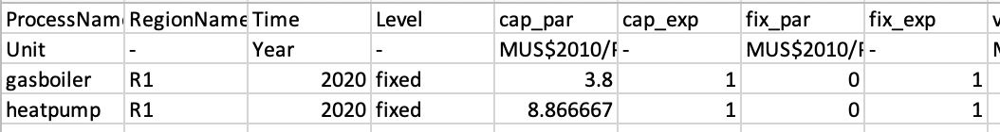
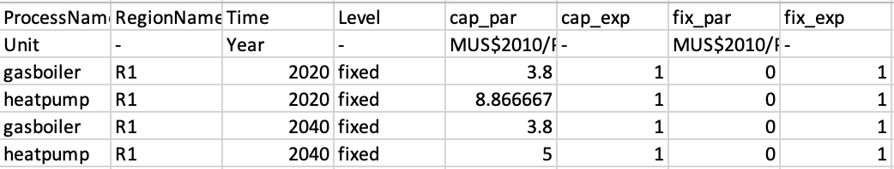

MUSE is flexible in its approach. It requires inputs for at least the base year, but doesn't necessarily need more than that to project forward. In this mini-lecture we will cover how MUSE deals with missing data and how to model future years

# Learning objectives

- Learn how to model costs in multiple years
- Understand how MUSE deals with missing data
- Understand interpolation

# Introduction

Within the input sheets you may have noticed the `Time` column. In the default example this is set to 2020. However, what happens beyond these years if we do not specify a cost, for example? Also, what happens in 2030 if we only specify a cost in 2020 and 2040?

Within MUSE, we make some assumptions. We assume that if there are no costs input into a model beyond a certain year, that the costs remain the same. This is known as a flat-forward extension. If, for example, we input costs in 2020 and 2040, we will interpolate the values in between these years linearly.

An example of this is, say that the capital costs for a gas boiler is set to be 4 for a gas boiler in 2020 and 2 in 2040. We haven't explicitly defined 2025, 2030 or 2035. Based on linear interpolation, MUSE will assume a value of 2.5 for 2025, 3 for 2030 (halfway between the year 2020 and 2040) and 3.5 for 2035. 

It must be noted, however, that MUSE does not allow a user to just update a single technology. For instance, if we want to specify the technology costs in 2035 for a coal power plant, we must also define the technology costs for every other technology in 2035. We do not need to define every year, however as interpolation and a flat-forward extension can still be used.

## Practical example

The figure below shows a snippet of the technodata file for the residential sector. We can see that we have data paramtetrising the technologies in 2020.

{width=100%}

**Figure 5.4.1:** Technodata for residential sector

Let's say that we want to update the capital costs for heat pumps in 2040, but don't want to update the prices for gasboilers. This is how we do it:

{width=100%}

**Figure 5.4.1:** Updated technodata for residential sector

Notice that we need seperate rows for both `heatpump` and `gasboiler` even though we are only making a change in the `heatpumnp` capital cost. If we don't do this we will encounter an error. In between 2020 and 2040 we will get interpolation.

# Summary

In this mini-lecture we learned how to update costs in the time domain, and the assumptions MUSE makes if we do not give costs for every year. Namely, flat-forward extension and interpolation. We also learnt how to practically input these values in MUSE with the `Technodata.csv` file.

