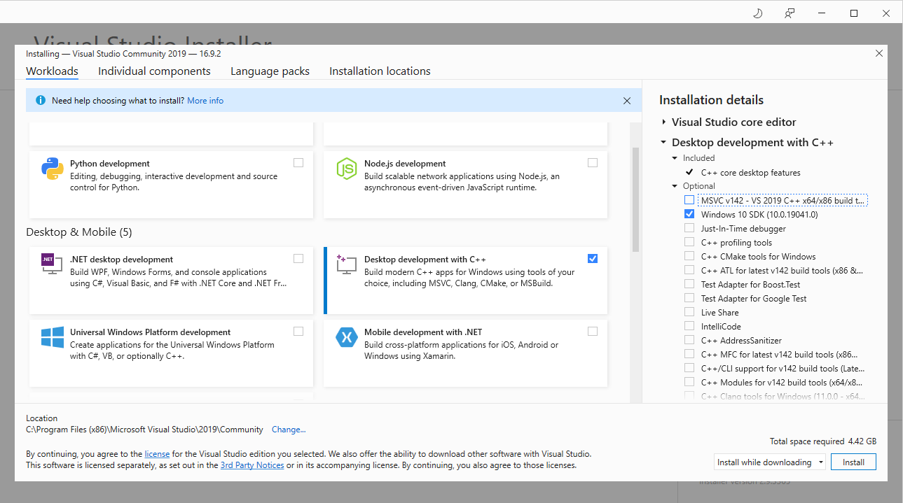
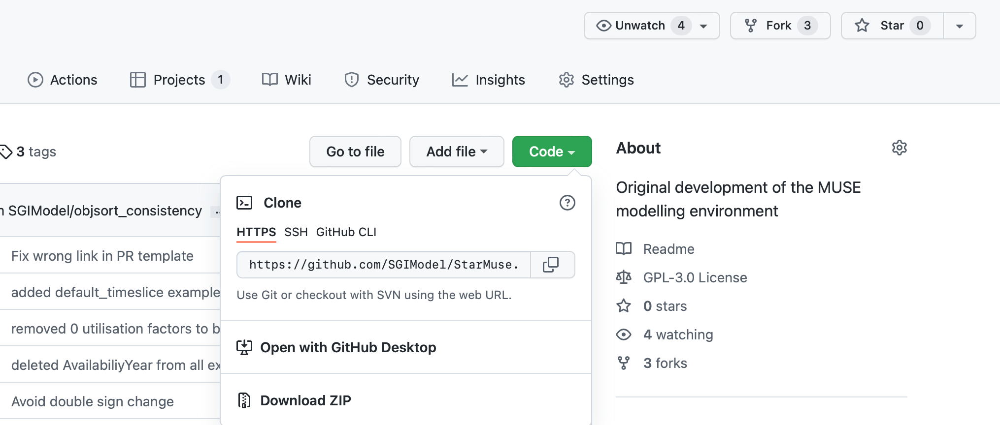

## Short description

This hands-on exercise will allow you to install MUSE on your computer. We will then take you though an example to run and visualise a default MUSE example.

## Learning objectives

-   Install MUSE
-   Run an example
-   Visualise the results of the example

# Exercise content

### For Windows users only

Windows users and developers may need to install `Windows Build Tools`__. These tools include C/C++ compilers which are needed to build some python dependencies.

MacOS includes compilers by default, hence no action is needed for Mac users.

Linux users may need to install a C compiler, whether GNU gcc or Clang, as well python development packages, depending on their distribution.

If you have MacOS or Linux you can skip this section and head to the next section below here.

1. Install Visual Studio from the following link: https://visualstudio.microsoft.com/downloads/

2. Select your preferred edition. Although, the "Community" version is free and contains what is required.

3. Install Visual Studio by selecting the default options.

4.   Download the Microsoft Visual C++ Build Tools from the following link by downloading Visual Studio 2019: https://visualstudio.microsoft.com/downloads/   

5. Select your preferred edition. The "Community" is free and contains what is required.

6.   Run the installer

7.   Select: Workloads → Desktop development with C++.

8. Install options: select only the “Windows 10 SDK” (assuming the computer is Windows 10)]. This will come up on the right hand side of the screen.

The installation screen should look similar to the following:

{width=100%}

**Figure 1.1:** Visual Studio Installer window


For further information, see this link: https://www.scivision.dev/python-windows-visual-c-14-required


## Installing MUSE

MUSE is developed using python, an open-source programming language, which means that there are two steps to the installation process. First, python should be installed. Then so should MUSE.

The simplest method to install python is by downloading the Anaconda distribution. Make sure to choose the appropriate operating system (e.g. windows), python version 3.8, and the 64 bit installer. Once this has been done follow the steps for the anaconda installer, as prompted.

After python is installed we can install MUSE. MUSE can be installed via the Anaconda Prompt (or any terminal on Mac and Linux). This is a command-line interface to python and the python eco-system. In the anaconda prompt, run:

```
python -m pip install --user git+https://github.com/SGIModel/StarMuse
```

It should now be possible to run muse. Again, this can be done in the anaconda prompt as follows:

```
python -m muse --help
```

## Running your first example

In this section we run an example simulation of MUSE, in the next section we will visualise the results.

First we need to download the MUSE source code. To do that navigate to the MUSE GitHub repository:
https://github.com/SGIModel/StarMuse

Click on the green `Code` button in the top right hand corner and then click on `Download ZIP`. Figure 2.1 shows how to do this, once you are on the relevant page.

{width=100%}

**Figure 2.1:** How to download MUSE

Once you have downloaded the source code, unzip the folder and move it to a location that is convenient for you.

We will place ours on the desktop for simplicity, but feel free to make a folder in your documents or otherwise. 

To run MUSE, we must open anaconda prompt for Windows machines or terminal if on MacOS or Linux. Then we must navigate to the directory using the prompt or terminal to find the MUSE examples. Ours is in Desktop, so we will run the following command:

```
cd ~/Desktop/StarMuse/run/example/default/
```

But yours could be in another location, so fill in the {MUSE_download_location} with your path (This could be `/Users/{my_name}/Documents` for instance):

```
cd {MUSE_download_location}/StarMuse/run/example/default/
```

Once we have navigated to the directory containing the example settings settings.toml we can run the simulation using the following command in the anaconda prompt or terminal:

```
python -m muse settings.toml
```

If running correctly, your prompt should output text similar to the following:
```
-- 2020-11-03 15:58:29 - muse.sectors.register - INFO
Sector legacy registered.

-- 2020-11-03 15:58:29 - muse.sectors.register - INFO
Sector preset registered, with alias presets.

-- 2020-11-03 15:58:29 - muse.sectors.register - INFO
Sector default registered.

-- 2020-11-03 15:58:29 - muse.readers.toml - INFO
Reading MUSE settings

-- 2020-11-03 15:58:29 - muse.readers.toml - INFO
 Default input values used: carbon_budget_control.commodities, carbon_budget_control.method, carbon_budget_control.debug, carbon_budget_control.control_undershoot, carbon_budget_control.control_overshoot, carbon_budget_control.method_options
```

## Results

If the default MUSE example has run successfully, you should now have a folder called `Results` in the same directory as `settings.toml`.

This directory should contain results for each sector (Gas,Power and Residential) as well as results for the entire simulation in the form of `MCACapacity.csv` and `MCAPrices.csv`.

`MCACapacity.csv` contains information about the capacity each agent has per technology per benchmark year. Each benchmark year is the modelled year in the `settings.toml` file. In our example, this is 2020, 2025, …, 2050.
`MCAPrices.csv` has the converged price of each commodity per benchmark year and timeslice. eg. the cost of electricity at night for electricity in 2020.
Within each of the sector result folders, there is an output for Capacity for each commodity in each year. The years into the future, which the simulation has not run to, refers to the capacity as it retires. Within the Residential folder there is also a folder for Supply within each year. This refers to how much end-use commodity was output.


## Summary


