This hands-on will allow users to define their own service demand for an exogenous sector or by correlation.


# Learning objectives

- Define own service demand for an exogenous sector
- Define own service demand by correlation

# Adding an exogenous service demand

As a quick example, in the residential sector a service demand could be cooking. Houses require energy to cook food and a technology to service this demand, such as an electric stove. 

We will start by looking at the `default` example. This can be found in your MUSE download at `/src/muse/data/example/default/example`, or you can download it at the following link:

https://zenodo.org/record/6022713#.YgOYyS-l1pQ

Next, download this and place it in a convenient location on your computer. We will now start by adding a cooking demand to this example. The default example currently only has a service demand of `heat`, so we will need to do some editing. 

To achieve this, we will need to edit the `Residential2020Consumption.csv` and `Residential2050Consumption.csv`files found within the `technodata/preset/` directory. The `Residential2020Consumption.csv` file allows us to specify the demand in 2020 for each region and technology per timeslice. The `Residential2050Consumption.csv` file does the same but for the year 2050. The datapoints between these are interpolated.

Firstly, we must add the new service demand `cook` as a column in these two files. Next, we add the demand. We can do this in Excel, or an editor of your choice. This is how it may look like for you when you open the `Residential2020Consumption.csv` file:

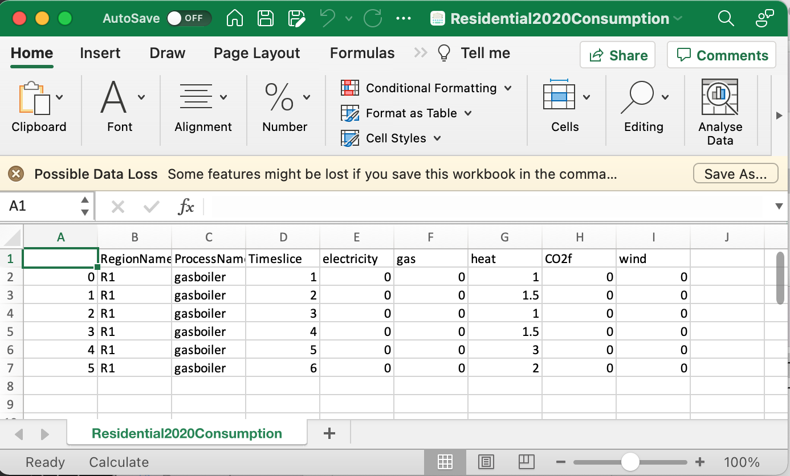{width=100%}

**Figure 2.1:** Residential2020Consumption file opened in Excel.

We will add a new column called `cook` and enter some values for each timeslice. This can be seen through the addition of a positive number in the `cook` column.

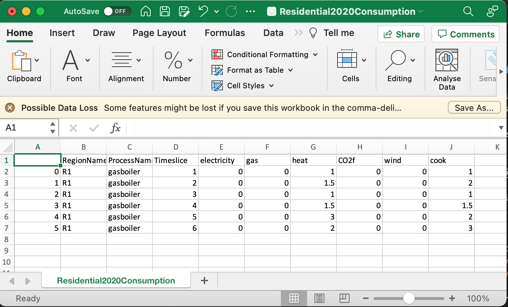{width=100%}

**Figure 2.2:** Modified Residential2020Consumption file opened in Excel.

The process is very similar for the `Residential2050Consumption.csv` file, however, for this example, we often placed larger numbers to indicate higher demand in 2050.

Next, we must edit the files within the `input` folder. For this, we must add the cook service demand to each of these files.

First, we will amend the `BaseYearExport.csv` and `BaseYearImport.csv` files. For this, we say that there is no import or export of the cook service demand. A brief example is outlined below for `BaseYearExport.csv`:

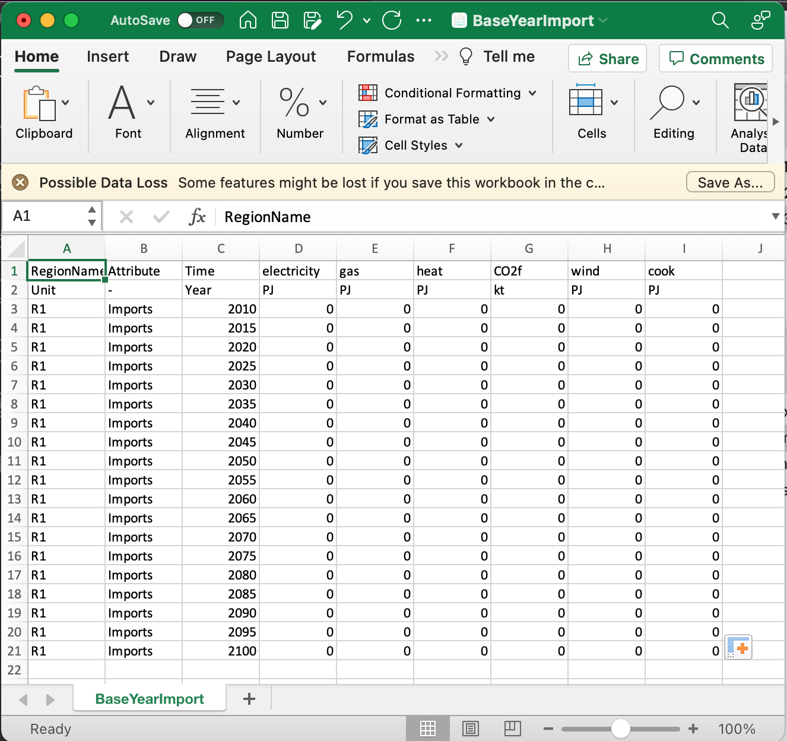{width=100%}

**Figure 2.3:** Modified BaseYearImport file opened in Excel.

The same is true for the `BaseYearImport.csv` file:

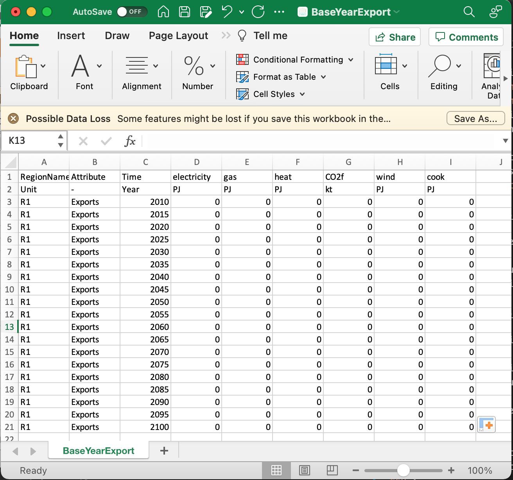{width=100%}

**Figure 2.4:** Modified BaseYearExport file opened in Excel.

Next, we must edit the `GlobalCommodities.csv` file. This is where we define the new commodity cook. It tells MUSE the commodity type, name, emissions factor of CO2 and heat rate, amongst other things.

The default version used for this tutorial is below:

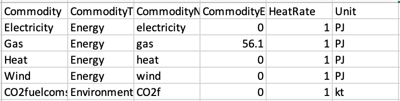{width=100%}

**Figure 2.5:** Non-edited GlobalCommodities file opened in Excel.

We then add a new line at the bottom to include the cook commodity:

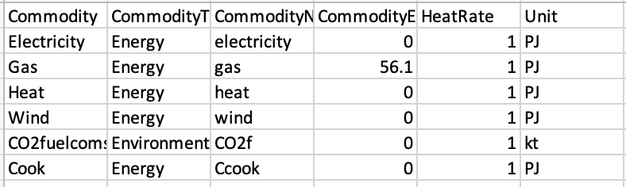{width=100%}

**Figure 2.6:** Edited GlobalCommodities file opened in Excel.

Finally, the `Projections.csv` file must be changed. This is a large file which details the expected cost of the technology in the first benchmark year of the simulation. We have highlighted in **bold** the changed column for this example.

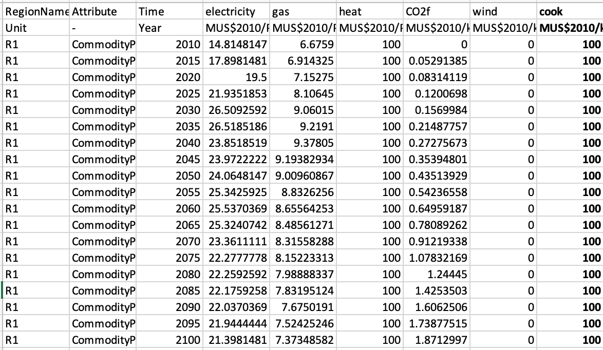{width=100%}

**Figure 2.7:** Edited Projections file opened in Excel.

## Addition of a cooking technology

Next, we must add a technology to service this new demand. During this process we must be careful to specify the end-use of the technology as cook.

For this example, we will add two competing technologies to service the cooking demand: `electric_stove` and `gas_stove` to the `Technodata.csv` file in `/technodata/residential/Technodata.csv`.

For this, we copy the `gasboiler` row for `R1` and paste it for the new `electric_stove`. For `gas_stove` we copy and paste the data for `heatpump` from region R1. In the figure below we show this, but only show the first few columns for the interest of space. We will also relax the growth constraints, to ensure that the growth in technologies can meet demand.

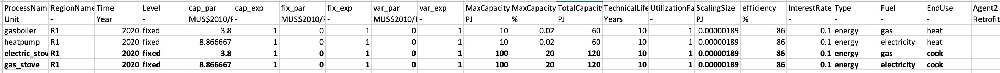{width=100%}

**Figure 2.8:** Edited technodata file opened in Excel.

As can be seen we have added two technologies with different cap_par costs. We specified their respective fuels, and the enduse for both is cook. 

We must also add the data for these new technologies to the following files:

- CommIn.csv
- CommOut.csv
- ExistingCapacity.csv

The `CommIn.csv` file details the input commodities for each technology. In this case, the inputs are gas and electricity. The `CommOut` file details the outputs of the technology, which will be the `cook` commodity.

We must add the input to each of the technologies (gas and electricity for `gas_stove` and `electric_stove` respectively), outputs of `cook` for both and the existing capacity for each technology.

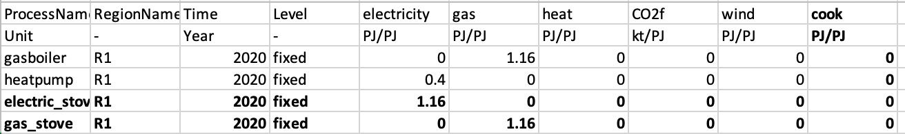{width=100%}

**Figure 2.9:** Edited CommIn file opened in Excel.

Notice in Figure 2.9 that we had to add a column for the new `cook`. We must also do the same for the CommOut file, below:

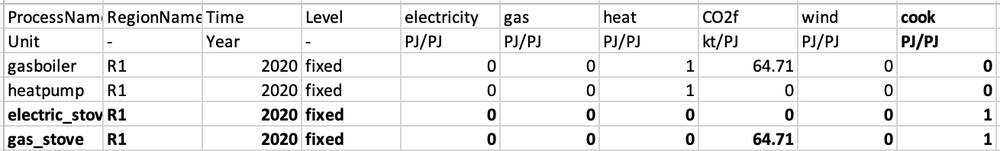{width=100%}

**Figure 2.10:** Edited CommOut file opened in Excel.

We must do this for the `gas` and `power` sector as well.

Next, we must edit the `ExistingCapacity.csv` file to detail how much existing capacity there is in the base year and beyond.

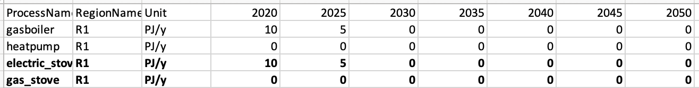{width=100%}

**Figure 2.11:** Edited ExistingCapacity file opened in Excel.

Due to the additional demand for gas and electricity brought on by the new cook demand, it is necessary to relax the growth constraints for `gassupply1` in the `technodata/gas/technodata.csv` file. For this example, we set this file as follows:

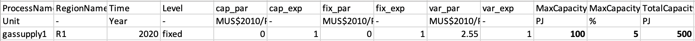{width=100%}

**Figure 2.12:** Edited gas/technodata file opened in Excel.

We must also ensure there are no `0` in the `ExistingCapacity.csv` for any of the sectors. Therefore, go through the `gas/ExistingCapacity.csv` and `power/ExistingCapacity.csv` and replace them with a non-zero value, such as `0.01`. Below is an example for the `gas` sector:

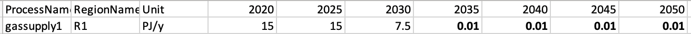{width=100%}

**Figure 2.13:** Edited gas/ExistingCapacity.csv file opened in Excel.

Next, we must run the simulation with our modified input files using the following command in the relevant directory:

```
python -m pip muse settings.toml
```

The figure below shows the results for this new demand in the residential sector:

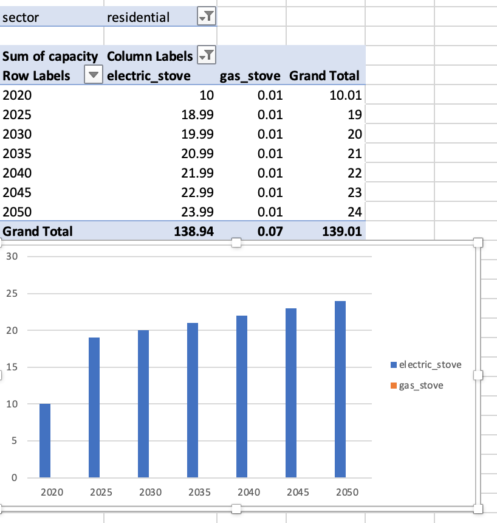{width=100%}

**Figure 2.14:** Capacity results for the residential sector.

We can see that `electric_stove` takes over completely. This is because of the lower `cap_par` value when compared to `gas_stove`.

For the final example input data showed in this tutorial and results spreadsheet, please refer to the link below:

https://zenodo.org/record/6022713#.YgOYyS-l1pQ

