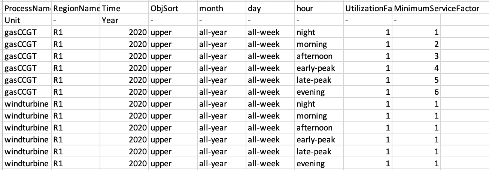
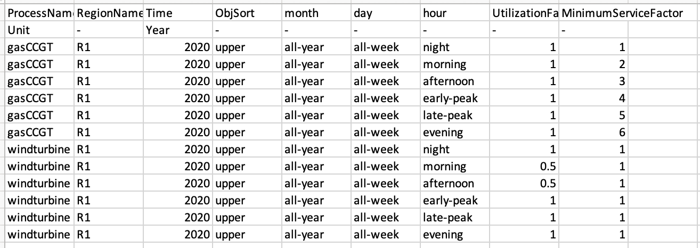

In this hands-on we explain how to add constraints to outputs of technologies at certain timeslices. This could either by a maximum constraint, for instance with the solar PV example mentioned in the previous lecture. Or, this could be a minimum constraint, where we expect a minimum amount of output by a nuclear power plant at all times.

# Learning objectives

-   Learn how to add min/max production constraints in MUSE

# Minimum timeslice

In this tutorial we will be amending the default example, which you can find in the following zenodo link:
https://zenodo.org/record/6026087#.YgPuHS-l1pQ

Firstly, we will be imposing a minimium service factor for gasCCGT in the power sector. This is the minimum that a technology can output per timeslice.

To do this, we will need to create a new csv file that specifies the minimum service factor per timeslice.

An example of the file can be seen below and in the zenodo link.


{width=100%}

**Figure 3.1:** TechnodataTimeslices.csv file for the power sector.

Notice that we have to specify the following columns: `ProcessName`, `RegionName`, `Time`, `month`, `day`, `hour`, `UtilizationFactor`, `MinimumServiceFactor`.

The majority of these columns are self explanatory, and correspond to the columns in other csv files - for instance, `ProcessName`, `RegionName` and `Time`. The timeslice based columns, however, are dynamic and will match the levels as defined in the toml file.

The majority of these columns are self explanatory, and correspond to the columns in other csv files - for instance, ProcessName, RegionName and Time. The timeslice based columns, however, are dynamic and will match the levels as defined in the `settings.toml` file in the main `default` folder.

```
[sectors.power]
type = 'default'
priority = 2
dispatch_production = 'costed'

technodata = '{path}/technodata/power/Technodata.csv'
commodities_in = '{path}/technodata/power/CommIn.csv'
commodities_out = '{path}/technodata/power/CommOut.csv'
technodata_timeslices = '{path}/technodata/power/TechnodataTimeslices.csv'
```

Once this has been completed, we are able to run MUSE as before, with the following command:

```
python -m muse settings.toml
```

We can then view the results as before using Excel.

# Maximum timeslice constraint

Next, we want to ensure that the supply of windturbine does not exceed a certain value during the day. This may be because, for example, there is reduced wind during the day. We will, therefore, modify the `TechnodataTimeslices.csv` file by changing the values of UtilizationFactor. This is shown in the figure below. Where we change the morning and afternoon timeslices to be 0.5, as an example.

{width=100%}

**Figure 3.2:** Edited TechnodataTimeslices file opened in Excel.

Once this has been saved, we can run the model again (`python -m muse settings.toml`). We can then visualise our results as before. 

# Summary

In this lecture we have introduced the `TimeslicesTechnodata.csv` file, and linked it to the `settings.toml` file. This has allowed us to vary the output of various energy technologies by their characteristics.
